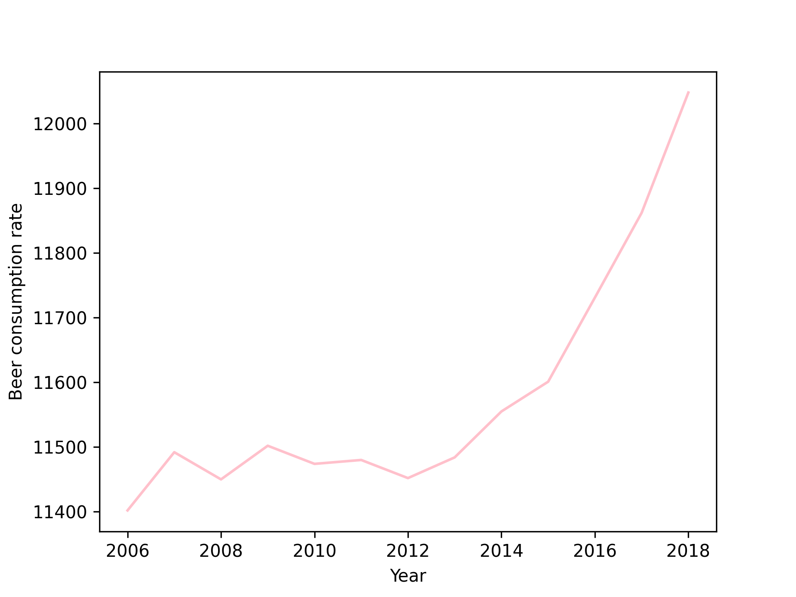

13150685
* "Fantastic yeasts and where to find them: the hidden diversity of dimorphic fungal pathogens" (MCC Van Dyke et al., 2019)
* "An analysis of the forces required to drag sheep over various surfaces" (JT Harvey, Applied Ergonomics, 2002)
* 'Uterine contractility and embryo implantation' (DW Ziegler et al., 2005)

